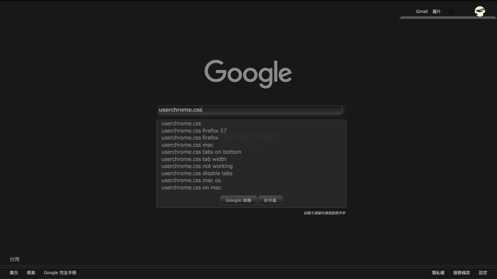

# Window fullscrean 

Auto hide titlebar, navigatorbar, bookmarkbar, and scrollbars via userchrome.css.
It works with Firefox 62.0.3 now.
*Updated: now it works with 65.0.1!*

How to use: just put "userChrome.css" and the folder to the directory : profile\chrome

Previews:

[More description and dicuss （in chinese):](https://www.ptt.cc/bbs/Browsers/M.1515375100.A.3ED.html "ptt discuss")
